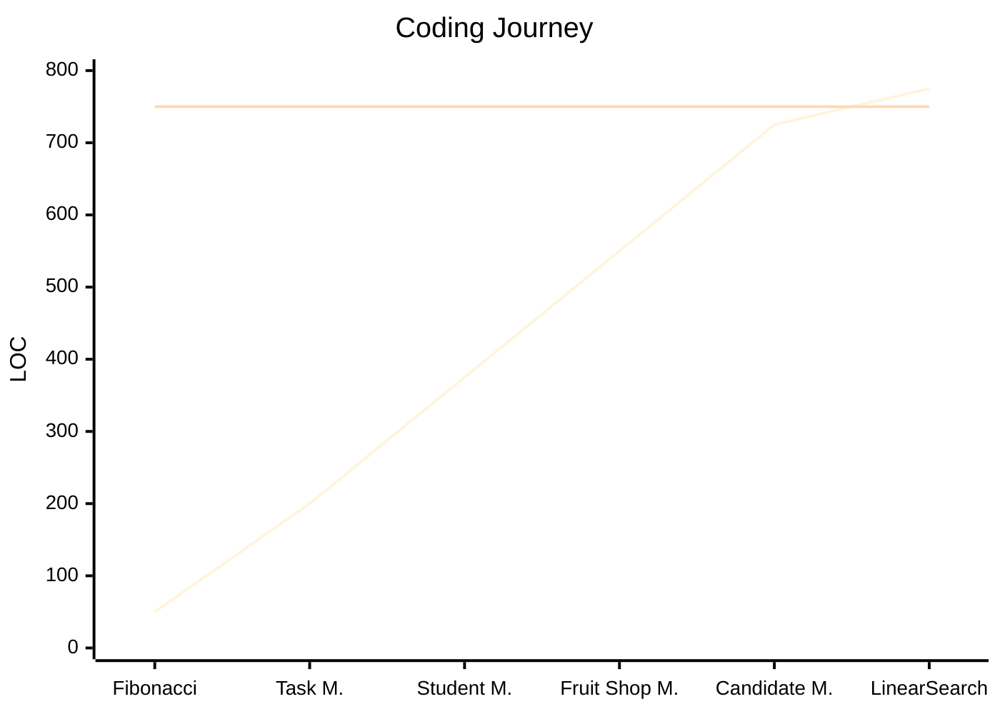

# Code LOC Summary

| # | Code Practice | LOC |
|---|---|---:|
| 1 | Fibonacci | 50 |
| 2 | Task Management | 150 |
| 3 | Student Management | 175 |
| 4 | Fruit Shop Management | 175 |
| 5 | Candidate Management | 175 |
| 6 | Linear Search | 50 |
|   | **Total** | **775** |

---

## LOC Progress

**Required:** 750 LOC
**Trung Anh have:** 775 LOC